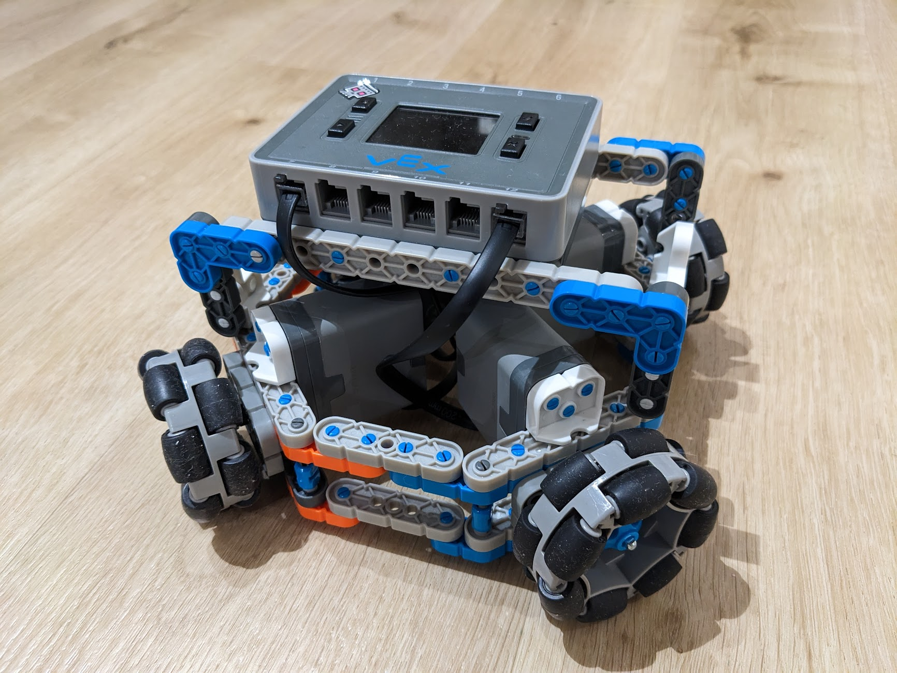
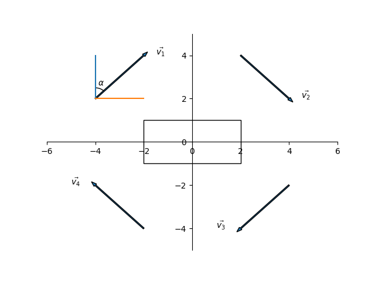

# Omnibot
## Introduction
This bot is built with Vex IQ 2nd generation components. Most of the parts are available from the competition kit. I also borrowed some beams and shafts from Hexbug build blitz. Here is a picture of it.  It uses 4 omni-directional wheels, which are located on the 4 corners of the bot.

## How does it work
To understand how the robot moves, we can represent each wheel by a vector, and decompose the vector along $x$ and $y$ axes. As shown in the following graph, left front wheel is represented by $\vec{v_1}$, right front wheel is represented by $\vec{v_2}$, right back wheel is represented by $\vec{v_3}$ and left back wheel is represented by $\vec{v_4}$. The angle between $\vec{v_1}$ and $y$ axis is $\alpha$. For the other vectors, the angles relative to $y$ axis are $\alpha + \frac{1}{2}\pi$, $\alpha + \pi$ and $\alpha + \frac{3}{2}\pi$ respectively.

Thus by decomposing these vectors, we have the following equations

$$v_x = v_1\sin\alpha + v_2\sin(\alpha+\frac{1}{2}\pi) + v_3\sin(\alpha+\pi) + v_4\sin(\alpha+\frac{3}{2}\pi)$$

$$v_y = v_1\cos\alpha + v_2\cos(\alpha+\frac{1}{2}\pi) + v_3\cos(\alpha+\pi) + v_4\cos(\alpha+\frac{3}{2}\pi)$$

Using the following trignometry equations,

$$\cos(\alpha+\frac{1}{2}\pi) = - \sin\alpha$$

$$\cos(\alpha+\pi) = - \cos\alpha$$

$$\cos(\alpha+\frac{3}{2}\pi) = \sin\alpha$$

$$\sin(\alpha+\frac{1}{2}\pi) = \cos\alpha$$

$$\sin(\alpha+\pi) = - \sin\alpha$$

$$\sin(\alpha+\frac{3}{2}\pi) = -\cos\alpha$$

We can simplify the vector equations to

$$v_x = v_1\sin\alpha + v_2\cos\alpha - v_3\sin\alpha - v_4\cos\alpha$$

$$v_y = v_1\cos\alpha - v_2\sin\alpha - v_3\cos\alpha + v_4\sin\alpha$$

which can be reorganized to

$$v_x = (v_1 - v_3)\sin\alpha + (v_2 - v_4)\cos\alpha$$

$$v_y = (v_1 - v_3)\cos\alpha - (v_2 - v_4)\sin\alpha$$

Solving these equations give

$$v_1 - v_3 = v_y\cos\alpha + v_x\sin\alpha$$

$$v_2 - v_4 = v_x\cos\alpha - v_y\sin\alpha$$

Notice that $\vec{v_1}$ and $\vec{v_3}$ works as a motor group, and $\vec{v_2}$ and $\vec{v_4}$ works as a motor group. With above equations, we can let the robot make some special moves.

### Move in a straight line

In order to move in a straight line, we can set $v_x$ to zero, which gives

$$v_1 - v_3 = v_y\cos\alpha$$

$$v_4 - v_2 = v_y\sin\alpha$$

Within the same motor group, when both wheels moving in the same direction with the same speed, they will keep in a straight line, otherwise, they will rotate along its $z$ axis. Thus to keep the robot moving in a straight line without rotation, we have

$$v_1 = -v_3 = \frac{1}{2}v_y\cos\alpha$$

$$v_4 = -v_2 = \frac{1}{2}v_y\sin\alpha$$

The negative sign here means that the vector direction is opposite to what we have specified previsouly.

### Move in a straight line and rotate along $z$ axis

As discussed in previous section, when the velocities within a motor group are not equal, there will be a rotation movement. Using the following trignometry equations

$$\cos{2\alpha} = \cos^2\alpha - \sin^2\alpha$$

$$\sin\alpha = \cos(\frac{\pi}{2}-\alpha)$$

We can derive

$$v_1 - v_3 = v_y(\cos^2\frac{\alpha}{2} - \sin^2\frac{\alpha}{2})$$

$$v_4 - v_2 = v_y(\cos^2(\frac{\pi}{4}-\frac{\alpha}{2}) - \sin^2(\frac{\pi}{4}-\frac{\alpha}{2}))$$

which gives

$$v_1 = v_y\cos^2\frac{\alpha}{2}$$

$$v_2 = v_y\sin^2(\frac{\pi}{4} - \frac{\alpha}{2})$$

$$v_3 = v_y\sin^2\frac{\alpha}{2}$$

$$v_4 = v_y\cos^2(\frac{\pi}{4} - \frac{\alpha}{2})$$

This is just one of the solutions. We choose these formulas so that the velocity has a maximum value of $v_y$. Assuming the moving direction has an angle $\theta$ with $y$ axis, if we rotate the coordinates by $\theta$ so that $y'$ is in the moving direction, then angle $\alpha$ becomes $\alpha' = \alpha - \theta$

### Omni-directional move
In this moving mode, instead of just moving the robot along its $y$ axis, the robot can move in any angle relative to $y$. The robot will keep its heading towards $y$ but moving in direction $y'$ which has an angle $\theta$ relative to $y$. Imagine we rotate the coordinates $x$-$y$ to $x'$-$y'$, then $\alpha$ will become $\alpha - \theta$, thus we have the following equations

$$v_1 = -v_3 = \frac{1}{2}v_y\cos(\alpha-\theta)$$

$$v_4 = -v_2 = \frac{1}{2}v_y\sin(\alpha-\theta)$$
